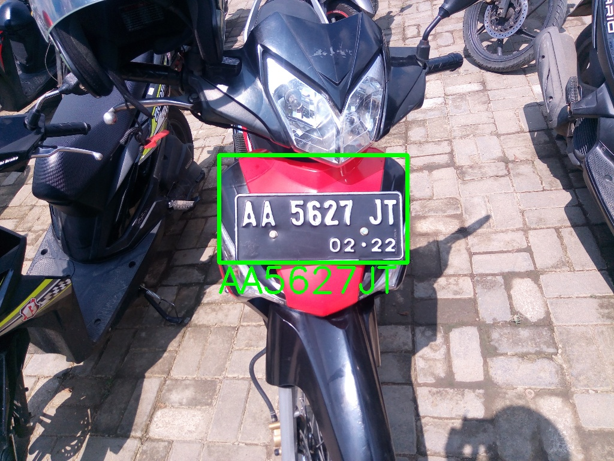

# Motorcycle-License-Plate-Recognition-with-TensorFlow-Keras

This specialized License Plate Recognition (LPR) system is designed for detecting license plates on motorcycles using TensorFlow and Keras for deep learning techniques. The system recognizes characters on motorcycle license plates, extracts the plate number, and saves the results to a database.

## How to Use

1. Clone the repository:

```
git clone https://github.com/roniragilimankhoirul/Motorcycle-License-Plate-Recognition-with-TensorFlow-Keras.git
 && cd Motorcycle-License-Plate-Recognition-with-TensorFlow-Keras
```

2. Create a virtual environment:

```
python -m venv myenv
```

3. Activate the virtual environments:

```
source myenv/bin/activate
```

4. Install Dependencies:

```
pip install -r requirements.txt
```

5. Set up your environment by creating a .env file with the following variables:

```
DB_HOST=your_database_host
DB_USER=your_database_user
DB_PASSWORD=your_database_password
DB_NAME=your_database_name
```

6. Training model:

```
python training.py
```

7. Run the image detection program and save to database:

```
python main.py <Image_Path>
```

### Example outputs


